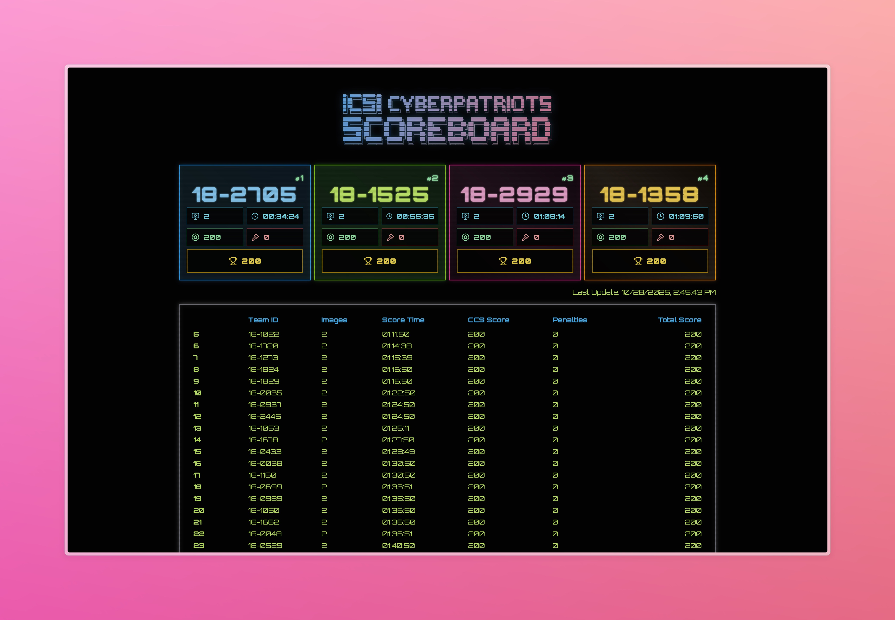

# CyberPatriot Live Scoreboard



A real-time scoreboard application for tracking CyberPatriot competition scores with a retro CRT-inspired interface.

## Overview

This Flask-SocketIO application provides a live scoreboard that fetches and displays CyberPatriot team scores in real-time. The application features a retro terminal aesthetic with CRT monitor effects and automatic score updates.

## Features

- **Real-time Score Updates**: Uses WebSocket connections via Socket.IO for instant score updates
- **Team Filtering**: Only displays scores for configured teams from teams.txt
- **Score Caching**: Implements 60-second caching to reduce API calls to the CyberPatriot scoreboard
- **Retro CRT Interface**: Styled with scanline effects, flicker animations, and a terminal-inspired design
- **CORS Support**: Configured for cross-origin requests

## Installation

1. **Clone the repository**
   ```bash
   git clone https://github.com/gussieIsASuccessfulWarlock/CyberPatriot-Live-Scoreboard.git
   cd ccs-scoreboard-backend
   ```

2. **Set up virtual environment**
   ```bash
   python3 -m venv .env
   source .env/bin/activate  # On Windows: .env\Scripts\activate
   ```

3. **Install dependencies**
   ```bash
   pip install flask flask-socketio flask-cors requests
   ```

4. **Configure teams**
   
   Edit teams.txt to include your team numbers (one per line):
   ```
   18-1234
   18-5678
   ```

## Usage

### Running the Server

```bash
python run.py
```

The server will start on `http://127.0.0.1:5000` by default.

### Accessing the Scoreboard

Open your browser and navigate to `http://127.0.0.1:5000`

## Project Structure

```
ccs-scoreboard-backend/
├── run.py          # Main application entry point
├── teams.txt
├── templates/
│   └── index.html
└── assets/            # Static assets
    ├── logo.png
    └── styles.css
```

## API Endpoints

### HTTP Routes

- **`GET /`** - Main scoreboard interface
- **`GET /assets/<path:path>`** - Static asset serving

### Socket.IO Events

- **`get_teams`** - Request list of configured teams
  - Emits: `teams` event with team list
  
- **`get_scores`** - Request current scores for all teams
  - Emits: `scores` event with score data
  
- **`get_score_update`** - Request updated scores (with comparison to current)
  - Receives: Current scores as JSON
  - Emits: `score_update` event with new scores

## Technical Details

### Data Source & Score Caching

The application implements a 60-second cache for API responses to avoid excessive requests to the CyberPatriot API.

Scores are fetched from the official CyberPatriot scoreboard API:
```
https://scoreboard.uscyberpatriot.org/api/team/scores.php
```

## Configuration

### CORS Configuration

CORS is configured to allow all origins:
```python
CORS(app)
socketio = SocketIO(app, cors_allowed_origins="*")
```

Modify this for production to restrict allowed origins.

## Dependencies

- **Flask** - Web framework
- **Flask-SocketIO** - WebSocket support
- **Flask-CORS** - Cross-origin resource sharing
- **requests** - HTTP library for API calls

## License

This project is licensed under the MIT License for educational purposes in support of CyberPatriot competition activities.

## Support

For issues or questions related to the CyberPatriot competition, visit [uscyberpatriot.org](https://www.uscyberpatriot.org/)